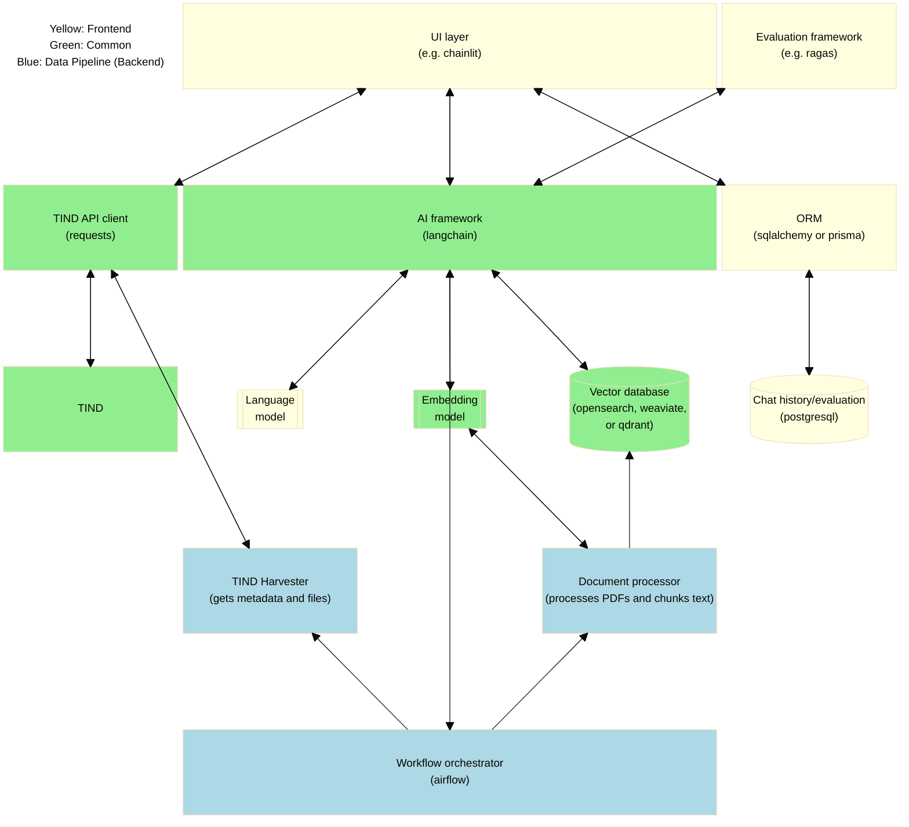

# Architecure

Proof of concept for fuller implementation.

```mermaid
---
config:
  theme: base
---
block-beta
    columns 5

    legend["Yellow: Frontend\nGreen: Common\nBlue: Data Pipeline (Backend)"]
    ui["UI layer\n(e.g. chainlit)"]:3
    evaluation["Evaluation framework\n(e.g. ragas)"]
    
    space:5
    
    client["TIND API client\n(requests)"]
    framework["AI framework\n(langchain)"]:3
    orm["ORM\n(sqlalchemy or prisma)"]
    
    space:5
    
    tind["TIND"]    
    lm[["Language\nmodel"]]
    embedding[["Embedding\nmodel"]]
    vectordb[("Vector database \n(opensearch, weaviate, \nor qdrant)")]
    db[("Chat history/evaluation \n(postgresql)")]

    space:5

    space
    harvester["TIND Harvester\n(gets metadata and files)"]
    space
    docprocessor["Document processor\n(processes PDFs and chunks text)"]
    space

    space:5

    space
    workflow["Workflow orchestrator\n(airflow)"]:3
    space

    workflow --> harvester
    workflow --> docprocessor 
    framework-->embedding
    framework-->vectordb
    vectordb -->framework
    framework --> workflow
    docprocessor --> vectordb
    docprocessor --> embedding
    embedding --> framework
    harvester -->client
    client--> tind
    tind --> client
    client --> harvester
    embedding--> docprocessor
    evaluation-->framework
    framework-->ui
    ui --> orm
    orm--> ui
    ui --> framework
    orm --> db
    db-->orm
    ui --> client
    client --> ui
    framework --> lm
    lm --> framework
    framework-->evaluation

    classDef fe fill: lightyellow
    class ui,evaluation,orm,lm,db fe

    classDef common fill: lightgreen
    class vectordb,framework,embedding,tind,client common

    classDef be fill: lightblue
    class harvester,docprocessor,workflow be

    style legend fill: white, stroke: white
```
