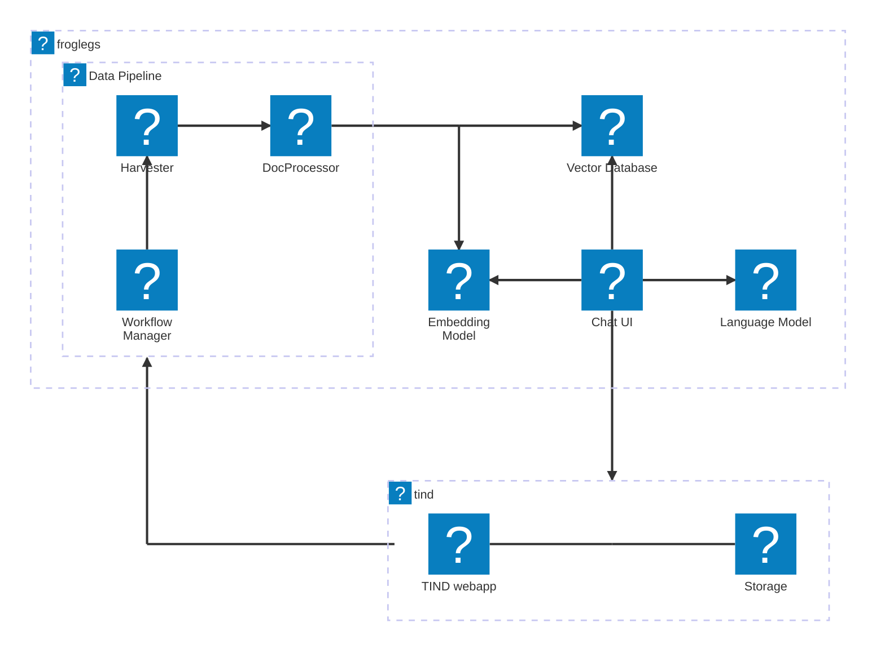

```mermaid
architecture-beta
    group tind(logos:aws)[tind]

    service disk1(logos:aws-s3)[Storage] in tind
    service app(logos:aws-ec2)[TIND webapp] in tind
    junction junctionTind in tind

    disk1:L -- R:junctionTind
    junctionTind:L -- R:app
    junction junctionExt
    group froglegs(logos:python)[froglegs]
    group pipeline(logos:airflow-icon)[Data Pipeline] in froglegs
    junction junctionTop in froglegs
    
    service queue(logos:airflow-icon)[Workflow Manager] in pipeline
    service harvester(logos:python)[Harvester] in pipeline
    service docprocessor(logos:python)[DocProcessor] in pipeline
    service vectordb(logos:qdrant-icon)[Vector Database] in froglegs
    service embedding(logos:mistral-ai-icon)[Embedding Model] in froglegs
    
    service llm(logos:mistral-ai-icon)[Language Model] in froglegs
    service ui(logos:python)[Chat UI] in froglegs


    queue:T --> B:harvester
    harvester:R --> L:docprocessor
    docprocessor:R -- L:junctionTop
    junctionTop:R --> L:vectordb
    junctionTop:B --> T:embedding
    ui:R --> L:llm
    ui:T --> B:vectordb
    ui:L --> R:embedding    
    ui:B --> T:junctionTind{group}
    app{group}:L -- R:junctionExt
    junctionExt:T --> B:queue{group}
```