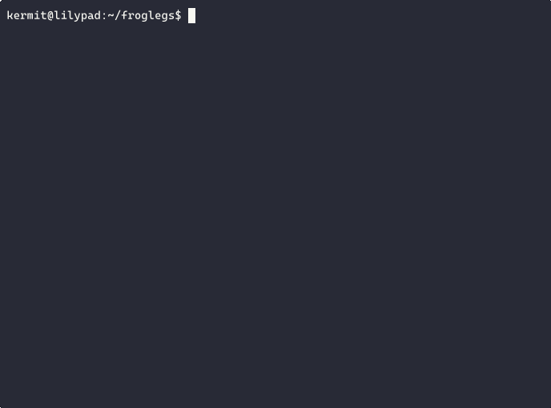

# froglegs :frog:

**froglegs** is a prototype RAG interface for PDF files.

## Requirements

* Pipenv.
* [Ollama](https://ollama.com/), plus models of choice (defaults to `nomic-embed-text` for embeddings and `phi4-mini` for generation).

Putting it all together:

```bash
$ git clone https://github.com/BerkeleyLibrary/froglegs.git && cd froglegs
$ pipenv install
$ ollama serve # probably you should start it as a background job somewhere
$ ollama pull nomic-embed-text
$ ollama pull phi4-mini
```

## Usage

A single PDF file:

```bash
$ python froglegs/poc.py filename.pdf
```

A directory of PDF files:
```bash
$ python froglegs/poc.py papers --recurse
```

The same, but using different models:

```bash
$ python froglegs/poc.py papers \
    --embedding-model=snowflake-arctic-embed \
    --generator-model=llama3.2
```

## Demo time!



```
$ python froglegs/poc.py avram.pdf # https://doi.org/10.14746/b.2023.27.8
🐸 froglegs | using nomic-embed-text & phi4-mini
🧮 Generating vectors of length 768 using nomic-embed-text.
parsing for Object Streams
🧩 Parsed 1 files into 82 chunks.
💁 phi4-mini is ready.
🗣️ What's your question?: Jaką rolę odegrała Henrietta Avram w tworzeniu formatu MARC?
💁 Result:
Henrietta Avram zainspirowała tworzenie formatu MARC w latach 1961-1976. Była 
odpowiedzialna za opracowanie architektury cyfrowego zapisu danych 
bibliograficznych i wdrażanie rozbudowanej wersji MARC II między 1965 a 2006,
popularizując go we wszystkich stanach Zjednoczonych oraz na całym 
świecie. Jej wkład w rozwój formatu MARC miał fundamentalne znaczenie dla
automatyzacji bibliograficznych usług i komunikacji.
```

## TODO

* [ ] Tests!
* [ ] Provide a true chat interface
* [ ] Conversational memory, etc.
* [ ] Fetch files and metadata from TIND
* [ ] Link to specific interviews
